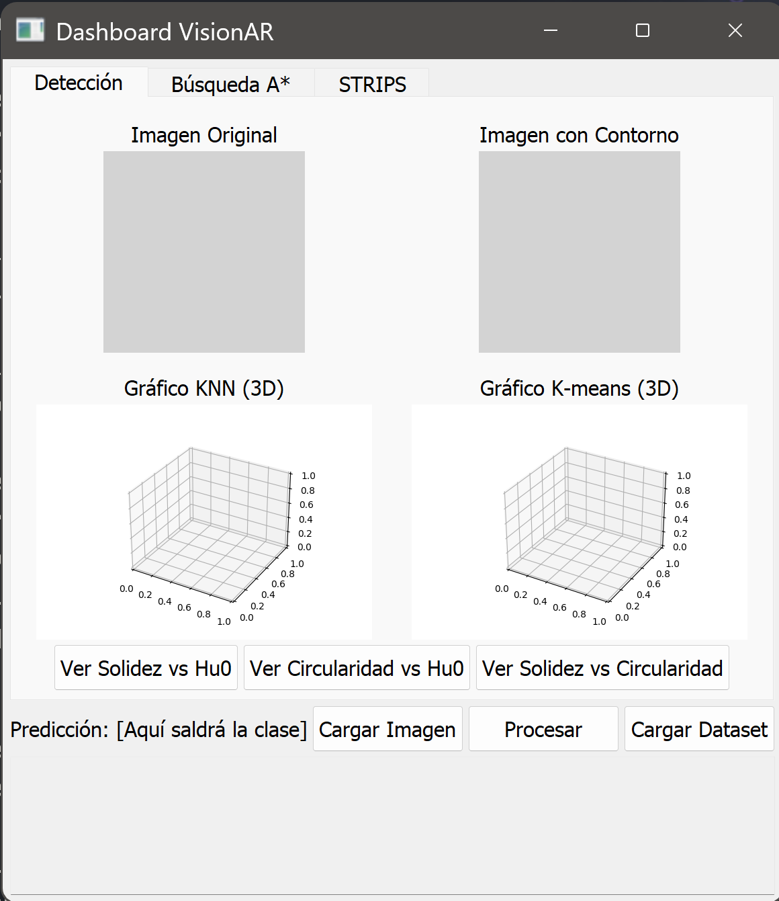
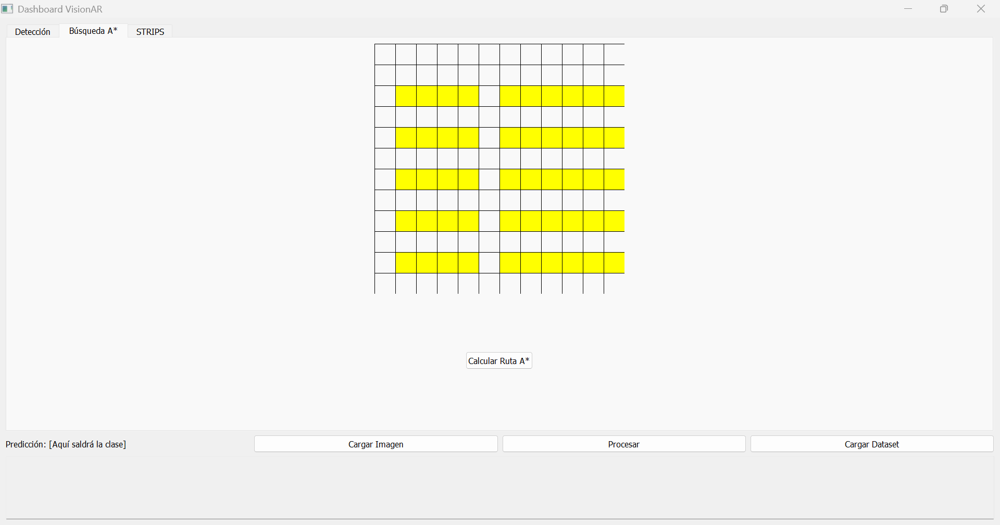
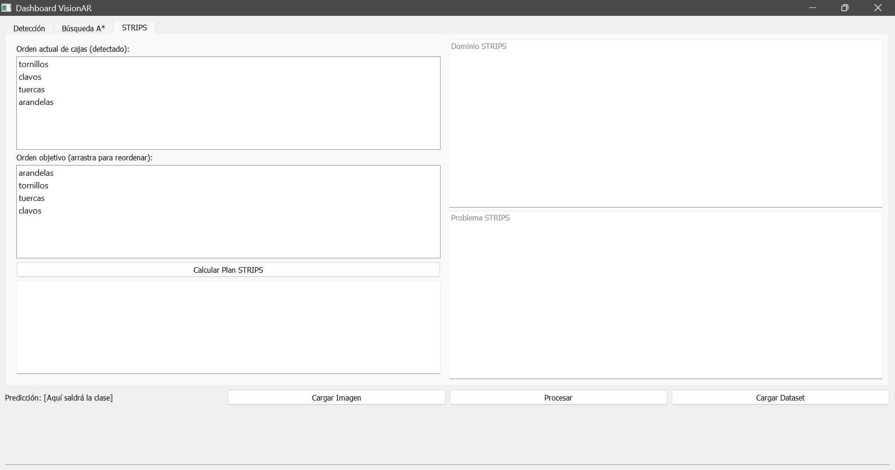

# Trabajo Final Inteligencia Artificial I – año 2022

**Titular:** Dra. Ing. Selva S. Rivera
**JTP:** Ing. Juan Ignacio
**Alumno:** Mario Stefano Papetti Funes
**Legajo:** 11807

---

## Resumen

El presente trabajo integrador final tiene como objetivo el desarrollo de un sistema inteligente capaz de clasificar piezas de ferretería (tuercas, arandelas, tornillos y clavos) utilizando técnicas de Visión Artificial. Adicionalmente, el sistema integra módulos de planificación para el ordenamiento lógico de contenedores y algoritmos de búsqueda para establecer rutas óptimas de movimiento en un entorno de almacén simulado. El proyecto combina algoritmos de extracción de características geométricas con modelos de aprendizaje supervisado (KNN) y no supervisado (K-Means), implementados bajo una arquitectura de software MVC (Modelo-Vista-Controlador).

## Introducción

La visión artificial es una disciplina científica que busca dotar a las máquinas de la capacidad de interpretar el mundo visual, procesando imágenes para producir información numérica o simbólica útil para la toma de decisiones. En el contexto de la automatización industrial, la clasificación eficiente de piezas pequeñas con alta similitud visual representa un desafío constante.

Este proyecto aborda dicho problema mediante la implementación de un agente que no solo "ve" las piezas a través de una cámara simulada (carga de imágenes), sino que procesa dicha información para categorizarlas y, posteriormente, planificar acciones sobre ellas.

### Descripción del Problema

El sistema debe diferenciar cuatro clases de objetos mediante un **Árbol de Decisión Geométrico**:

1. **Discriminación por Forma General:**
    * Objetos con alta **Circularidad** ($\approx 1$) $\rightarrow$ Tuercas o Arandelas.
    * Objetos con baja Circularidad (alargados) $\rightarrow$ Tornillos o Clavos.
2. **Discriminación de Objetos Circulares:**
    * **Arandela:** Círculo perfecto sin esquinas. Circularidad máxima ($0.95 - 1.0$).
    * **Tuerca:** Forma hexagonal. Circularidad menor ($0.80 - 0.88$) debido a sus vértices.
3. **Discriminación de Objetos Alargados (Solidez):**
    * **Clavo:** Contorno liso que coincide casi perfectamente con su envolvente convexa (*Convex Hull*). **Solidez Alta** ($>0.9$).
    * **Tornillo:** La presencia de la rosca genera espacios vacíos entre el contorno real y la envolvente convexa. **Solidez Baja** ($<0.9$).

## Especificación del Agente

Se define un agente basado en objetivos que aprende de su entorno. Debido a las variaciones potenciales en la entrada visual (brillo, rotación), el agente requiere un procesamiento robusto de características.

### Tabla REAS

| Agente | Medidas de Rendimiento | Entorno | Actuadores | Sensores |
| :--- | :--- | :--- | :--- | :--- |
| **Clasificador Inteligente** | - Precisión en la clasificación (%)<br>- Optimalidad de la ruta (costo mínimo)<br>- Validez del plan de ordenamiento | - Cinta transportadora (Imágenes)<br>- Almacén (Grilla) <br>- Área de apilado (Cajas) | - Interfaz Gráfica (GUI)<br>- Visualización de contornos<br>- Trazado de rutas | - Carga de archivos (Simulación de Cámara)<br>- Selección de coordenadas (Mouse) |

### Propiedades del Entorno de Trabajo

| Entorno | Observable | Determinista | Episódico | Estático | Discreto | Agentes |
| :--- | :--- | :--- | :--- | :--- | :--- | :--- |
| **Almacén/Visión** | Parcialmente Observable | Estocástico | Episódico | No dinámico (Estático durante el análisis) | Discreto | Individual |

## Diseño del Agente

El sistema se ha desarrollado en **Python** utilizando la librería **PyQt5** para la interfaz y **OpenCV** para el procesamiento de imágenes, siguiendo el patrón de diseño **MVC (Modelo-Vista-Controlador)** para desacoplar la lógica de la representación visual.

### Algoritmos Implementados

1. **Extracción de Características (Vision):**
    * **Momentos de Hu:** 7 momentos invariantes a la escala, traslación y rotación. Se utiliza principalmente $h_0$ con transformación logarítmica para facilitar la escala numérica.
    * **Solidez (Solidity):** Relación $Area_{Contorno} / Area_{ConvexHull}$. Fundamental para distinguir formas lisas de formas dentadas.
    * **Circularidad:** Relación $4\pi \cdot Area / Perímetro^2$.

2. **Aprendizaje Automático:**
    * **KNN (K-Nearest Neighbors):** Clasificación supervisada basada en la distancia Euclidiana a los ejemplos de entrenamiento más cercanos.
    * **K-Means (Clustering):** Agrupamiento no supervisado. Se implementó una **inicialización inteligente de centroides** basada en los promedios de las clases conocidas para evitar la aleatoriedad en la asignación de clústeres y mejorar la consistencia visual.

3. **Navegación y Planificación:**
    * **A\* (A-Star):** Algoritmo de búsqueda informada que utiliza la distancia Manhattan como heurística para encontrar el camino más corto en una grilla con obstáculos.
    * **STRIPS:** Planificador simbólico que define estados y operadores (Apilar/Desapilar) para reordenar cajas desde un estado inicial a uno objetivo.

## Código Desarrollado

Se ha omitido la inserción directa del código fuente en este documento para mantener la estructura del informe. El desarrollo completo se encuentra organizado en los módulos `model`, `view` y `controller`, siguiendo las buenas prácticas del patrón MVC mencionado anteriormente.

### Main

Para lo que es el código dentro del archivo `main.py` que declara los objetos de clases Models, Views y Controllers que el programa requiere para inicializar.

```python
import sys
import traceback
from PyQt5.QtWidgets import QApplication
from model.image_model import ImageModel
from model.database_model import DatabaseModel
from model.prediction_model import PredictionModel
from view.main_window import MainWindow
from controller.main_controller import MainController

def main():
    """
    Punto de entrada de la aplicación VisionAR.
    
    Se encarga de:
    1. Inicializar el entorno de Qt (QApplication).
    2. Instanciar los modelos de negocio (Lógica).
    3. Instanciar la vista principal (Interfaz Gráfica).
    4. Conectar ambos mediante el Controlador (Patrón MVC).
    5. Iniciar el ciclo de eventos de la aplicación.
    """
    try:
        # Inicializa la aplicación PyQt
        app = QApplication(sys.argv)
        
        # --- Inicialización de la Capa MODELO ---
        image_model = ImageModel()
        database_model = DatabaseModel()
        
        # El modelo de predicción depende del modelo de base de datos (para normalización)
        prediction_model = PredictionModel(database_model)

        # Diccionario que agrupa los modelos para pasarlos limpiamente al controlador
        modelos = {
            "image": image_model,
            "database": database_model,
            "prediction": prediction_model
            # "astar" y "strips" se inicializan dentro del controlador actualmente,
            # pero podrían moverse aquí si se desea inyección de dependencias pura.
        }

        # --- Inicialización de la Capa VISTA ---
        vista = MainWindow()

        # --- Inicialización de la Capa CONTROLADOR ---
        # El controlador recibe los modelos y la vista para gestionar la interacción.
        controlador = MainController(modelo=modelos, vista=vista)

        # Mostrar la ventana principal
        vista.show()

        # Ejecutar el ciclo de eventos (Loop principal)
        sys.exit(app.exec())

    except Exception as e:
        print("Error fatal al iniciar la aplicación:")
        traceback.print_exc()
        sys.exit(1)

if __name__ == "__main__":
    main()
```

### Models

Dentro de la carpeta models contiene los siguiente archivos que permiten declarar constructivamente el interior de las clases que dan lugar a la lógica de cada proceso necesario. Entre ellos se tienen:

1. **image_model.py**
    * **def calcular_caracteristicas(self, imagen):** Toma una imagen BGR y retorna las 3 características Hu[0], Circularidad y Solidez.

    * **def generar_imagen_contorno(self, imagen_cv):** Genera el contorno de la imagen procesada y la dibuja por sobre la imagen original.

    * **def resize(self, image, width=None, height=None, inter=cv2.INTER_AREA):** Toma cómo parámetros la imagen, el nuevo valor de ancho, el nuevo valor de alto y .

    * **def filtrado(self, img):** Función que aplica los procesos de filtrado a la imagen origina, lo que entrega una imagen filtrada.

2. **database_model.py**
    * **def cargar_dataset(self, ruta_dataset):** Carga un dataset desde una carpeta. Se espera que dentro de 'ruta_dataset' existen subcarpetas con el nombre de cada clase y cada subcarpeta contenga imágenes.
    Recibe: La cadena de carácteres que denota dónde está la ubicación de la carpeta.
    Devuelve: El número de imágenes cargadas del dataset.

    * **def actualizar_normalizacion(self):** Función que calcula la media y la desviación estándar de las primeras 3 caracterísiticas (usadas en la normalización) a partir de los datos de entrenamiento.

    * **def normalizar(self, features):** Normaliza un vector de características usando la media y desviación estándar calculadas.
    Recibe: un vector de características.
    Devuelve: un vector normalizado.

    * **def desnormalizar(self, features):** Realiza la operación inversa a la normalización, recuperando los valores originales.
    Recibe: un vector normalizado.
    Devuelve: un vector desnormalizado.

3. **prediction_model.py**
    * **def knn_manual(self, nuevo_punto, k=3):** Implementación del algoritmo de clusterización Knn (K Near ).
    Recibe: El vector de características que tiene una imagen y la cantidad de clusters que requiere.

### Views

Dentro de la ca.
<mark style="background-color: lightblue;"><span style="color: purple;">Texto blanco resaltado</span></mark>


### Controllers

Dentro de la ca.

## Ejemplo de Aplicación

La interfaz gráfica permite al usuario interactuar con los tres subsistemas del agente, obteniendo los siguientes comportamientos:

1. **Caso de Clasificación:**
    * **Entrada:** Se selecciona una imagen de un **Tornillo**.
    * **Proceso:** El modelo de visión detecta el contorno y calcula una solidez baja (aprox. 0.85). El modelo de predicción normaliza estos valores.
    * **Salida:** KNN identifica los vecinos más cercanos en el dataset y etiqueta la muestra como "Tornillo". K-Means asigna la muestra al clúster correspondiente a los objetos alargados y complejos.



2. **Caso de Navegación (A\*):**
    * **Entrada:** El usuario marca un punto de Inicio (0,0) y un punto de Fin (5,5) en la grilla del almacén.
    * **Salida:** El sistema dibuja una ruta óptima en color azul esquivando los obstáculos amarillos, minimizando la función de costo $f(n) = g(n) + h(n)$.



3. **Caso de Planificación (STRIPS):**
    * **Objetivo:** Cambiar el orden de apilamiento de una pila `[Tuerca, Clavo]` a `[Clavo, Tuerca]`.
    * **Salida:** El planificador genera la secuencia de texto: "1. Desapilar Tuerca, 2. Desapilar Clavo, 3. Apilar Tuerca, 4. Apilar Clavo".



## Resultados y Análisis

Durante las pruebas realizadas con el dataset propio, se obtuvieron las siguientes observaciones técnicas:

* **Importancia de la Normalización:** La implementación de la estandarización (Z-Score) fue crítica. Sin ella, las diferencias de magnitud entre los Momentos de Hu (logarítmicos) y la Circularidad (0-1) sesgaban las distancias euclidianas, haciendo fallar al algoritmo KNN.
* **Discriminación Efectiva:** La característica de **Solidez** demostró ser el discriminante más robusto para separar tornillos de clavos, logrando una tasa de acierto superior al 95% en imágenes con buen contraste.
* **Visualización:** Los gráficos 2D y 3D generados permitieron validar visualmente que las clases forman grupos compactos y separables en el espacio vectorial de características, confirmando la viabilidad de los algoritmos seleccionados.

## Conclusiones

El trabajo finalizó con la integración exitosa de visión computacional y razonamiento lógico. Se concluye que, para entornos controlados de ferretería, no es estrictamente necesario el uso de redes neuronales profundas (Deep Learning); el uso de descriptores geométricos clásicos junto con algoritmos ligeros como KNN y K-Means ofrece una solución computacionalmente eficiente y explicable.

Como trabajo a futuro, se propone la integración de una cámara física en tiempo real y la conexión del módulo STRIPS con un brazo robótico físico para ejecutar el reordenamiento planificado automáticamente.

## Bibliografía

1. Russell, S., & Norvig, P. (2021). *Artificial Intelligence: A Modern Approach*. Pearson.
2. Bradski, G., & Kaehler, A. (2008). *Learning OpenCV: Computer vision with the OpenCV library*. O'Reilly Media.
3. Material de la Cátedra Inteligencia Artificial I (2022), Facultad de Ingeniería, UNCUYO.
